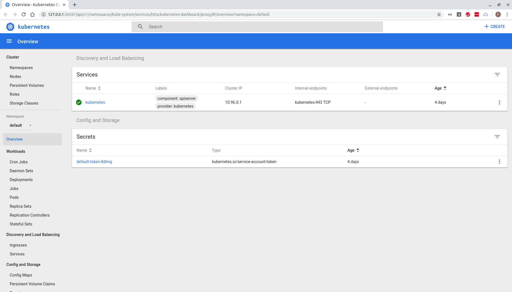

## setup
```
feng@ubuntu:~$ mkdir k8s-v2
feng@ubuntu:~$ cd k8s-v2
feng@ubuntu:~/k8s-v2$ curl -u 'fen9li' https://api.github.com/user/repos -d '{"name":"k8s-v2"}' | jq '.ssh_url'
Enter host password for user 'fen9li':
  % Total    % Received % Xferd  Average Speed   Time    Time     Time  Current
                                 Dload  Upload   Total   Spent    Left  Speed
100  5140  100  5123  100    17   3277     10  0:00:01  0:00:01 --:--:--  3286
"git@github.com:fen9li/k8s-v2.git"
feng@ubuntu:~/k8s-v2$ 

feng@ubuntu:~/k8s-v2$ git init
Initialized empty Git repository in /home/feng/k8s-v2/.git/
feng@ubuntu:~/k8s-v2$ git remote add origin git@github.com:fen9li/k8s-v2.git
feng@ubuntu:~/k8s-v2$ git remote -v
origin  git@github.com:fen9li/k8s-v2.git (fetch)
origin  git@github.com:fen9li/k8s-v2.git (push)
feng@ubuntu:~/k8s-v2$ git config --global --list
user.name=Feng Li
user.email=lifcn@yahoo.com
feng@ubuntu:~/k8s-v2$

feng@ubuntu:~/k8s-v2$ git status
On branch master

No commits yet

Untracked files:
  (use "git add <file>..." to include in what will be committed)

        README.md

nothing added to commit but untracked files present (use "git add" to track)
feng@ubuntu:~/k8s-v2$ 

feng@ubuntu:~/k8s-v2$ git add .
feng@ubuntu:~/k8s-v2$ git commit -am "initial commit"
[master (root-commit) afaaf98] initial commit
 1 file changed, 0 insertions(+), 0 deletions(-)
 create mode 100644 README.md
feng@ubuntu:~/k8s-v2$ 

feng@ubuntu:~/k8s-v2$ git push --set-upstream origin master
Enumerating objects: 3, done.
Counting objects: 100% (3/3), done.
Writing objects: 100% (3/3), 210 bytes | 210.00 KiB/s, done.
Total 3 (delta 0), reused 0 (delta 0)
To github.com:fen9li/k8s-v2.git
 * [new branch]      master -> master
Branch 'master' set up to track remote branch 'master' from 'origin'.
feng@ubuntu:~/k8s-v2$ 
```

## dashboard
* start minikube
```
feng@ubuntu:~$ minikube start
😄  minikube v1.2.0 on linux (amd64)
💡  Tip: Use 'minikube start -p <name>' to create a new cluster, or 'minikube delete' to delete this one.
🔄  Restarting existing virtualbox VM for "minikube" ...
⌛  Waiting for SSH access ...
🐳  Configuring environment for Kubernetes v1.15.0 on Docker 18.09.6
🔄  Relaunching Kubernetes v1.15.0 using kubeadm ... 
⌛  Verifying: apiserver proxy etcd scheduler controller dns
🏄  Done! kubectl is now configured to use "minikube"
feng@ubuntu:~$ 
```

* check if dashboard addons enable
```
feng@ubuntu:~$ minikube status
host: Running
kubelet: Running
apiserver: Running
kubectl: Correctly Configured: pointing to minikube-vm at 192.168.99.101
feng@ubuntu:~$ 

feng@ubuntu:~$ minikube addons list | grep dashboard
- dashboard: enabled
feng@ubuntu:~$ 

```

* start dashboard
```
feng@ubuntu:~$ minikube dashboard
🤔  Verifying dashboard health ...
🚀  Launching proxy ...
🤔  Verifying proxy health ...
🎉  Opening http://127.0.0.1:36587/api/v1/namespaces/kube-system/services/http:kubernetes-dashboard:/proxy/ in your default browser...
[7128:7148:0720/192655.452001:ERROR:browser_process_sub_thread.cc(221)] Waited 3 ms for network service
Opening in existing browser session.

```



## to list all suported API versions and resources
```
feng@ubuntu:~/k8s-v2$ k api-versions
admissionregistration.k8s.io/v1beta1
apiextensions.k8s.io/v1beta1
apiregistration.k8s.io/v1
apiregistration.k8s.io/v1beta1
apps/v1
apps/v1beta1
apps/v1beta2
authentication.k8s.io/v1
authentication.k8s.io/v1beta1
authorization.k8s.io/v1
authorization.k8s.io/v1beta1
autoscaling/v1
autoscaling/v2beta1
autoscaling/v2beta2
batch/v1
batch/v1beta1
certificates.k8s.io/v1beta1
coordination.k8s.io/v1
coordination.k8s.io/v1beta1
events.k8s.io/v1beta1
extensions/v1beta1
networking.k8s.io/v1
networking.k8s.io/v1beta1
node.k8s.io/v1beta1
policy/v1beta1
rbac.authorization.k8s.io/v1
rbac.authorization.k8s.io/v1beta1
scheduling.k8s.io/v1
scheduling.k8s.io/v1beta1
storage.k8s.io/v1
storage.k8s.io/v1beta1
v1
feng@ubuntu:~/k8s-v2$ 

feng@ubuntu:~/k8s-v2$ k api-resources
NAME                              SHORTNAMES   APIGROUP                       NAMESPACED   KIND
bindings                                                                      true         Binding
componentstatuses                 cs                                          false        ComponentStatus
configmaps                        cm                                          true         ConfigMap
endpoints                         ep                                          true         Endpoints
events                            ev                                          true         Event
limitranges                       limits                                      true         LimitRange
namespaces                        ns                                          false        Namespace
nodes                             no                                          false        Node
persistentvolumeclaims            pvc                                         true         PersistentVolumeClaim
persistentvolumes                 pv                                          false        PersistentVolume
pods                              po                                          true         Pod
podtemplates                                                                  true         PodTemplate
replicationcontrollers            rc                                          true         ReplicationController
resourcequotas                    quota                                       true         ResourceQuota
secrets                                                                       true         Secret
serviceaccounts                   sa                                          true         ServiceAccount
services                          svc                                         true         Service
mutatingwebhookconfigurations                  admissionregistration.k8s.io   false        MutatingWebhookConfiguration
validatingwebhookconfigurations                admissionregistration.k8s.io   false        ValidatingWebhookConfiguration
customresourcedefinitions         crd,crds     apiextensions.k8s.io           false        CustomResourceDefinition
apiservices                                    apiregistration.k8s.io         false        APIService
controllerrevisions                            apps                           true         ControllerRevision
daemonsets                        ds           apps                           true         DaemonSet
deployments                       deploy       apps                           true         Deployment
replicasets                       rs           apps                           true         ReplicaSet
statefulsets                      sts          apps                           true         StatefulSet
tokenreviews                                   authentication.k8s.io          false        TokenReview
localsubjectaccessreviews                      authorization.k8s.io           true         LocalSubjectAccessReview
selfsubjectaccessreviews                       authorization.k8s.io           false        SelfSubjectAccessReview
selfsubjectrulesreviews                        authorization.k8s.io           false        SelfSubjectRulesReview
subjectaccessreviews                           authorization.k8s.io           false        SubjectAccessReview
horizontalpodautoscalers          hpa          autoscaling                    true         HorizontalPodAutoscaler
cronjobs                          cj           batch                          true         CronJob
jobs                                           batch                          true         Job
certificatesigningrequests        csr          certificates.k8s.io            false        CertificateSigningRequest
leases                                         coordination.k8s.io            true         Lease
events                            ev           events.k8s.io                  true         Event
daemonsets                        ds           extensions                     true         DaemonSet
deployments                       deploy       extensions                     true         Deployment
ingresses                         ing          extensions                     true         Ingress
networkpolicies                   netpol       extensions                     true         NetworkPolicy
podsecuritypolicies               psp          extensions                     false        PodSecurityPolicy
replicasets                       rs           extensions                     true         ReplicaSet
ingresses                         ing          networking.k8s.io              true         Ingress
networkpolicies                   netpol       networking.k8s.io              true         NetworkPolicy
runtimeclasses                                 node.k8s.io                    false        RuntimeClass
poddisruptionbudgets              pdb          policy                         true         PodDisruptionBudget
podsecuritypolicies               psp          policy                         false        PodSecurityPolicy
clusterrolebindings                            rbac.authorization.k8s.io      false        ClusterRoleBinding
clusterroles                                   rbac.authorization.k8s.io      false        ClusterRole
rolebindings                                   rbac.authorization.k8s.io      true         RoleBinding
roles                                          rbac.authorization.k8s.io      true         Role
priorityclasses                   pc           scheduling.k8s.io              false        PriorityClass
csidrivers                                     storage.k8s.io                 false        CSIDriver
csinodes                                       storage.k8s.io                 false        CSINode
storageclasses                    sc           storage.k8s.io                 false        StorageClass
volumeattachments                              storage.k8s.io                 false        VolumeAttachment
feng@ubuntu:~/k8s-v2$ 
```

## start apiserver proxy to explore k8s objects
* The apiserver paths can be explored about your cluster
```
feng@ubuntu:~/k8s-v2$ curl http://localhost:8001
{
  "paths": [
    "/api",
    "/api/v1",
    "/apis",
    "/apis/",
    "/apis/admissionregistration.k8s.io",
    "/apis/admissionregistration.k8s.io/v1beta1",
    "/apis/apiextensions.k8s.io",
    "/apis/apiextensions.k8s.io/v1beta1",
    "/apis/apiregistration.k8s.io",
    "/apis/apiregistration.k8s.io/v1",
    "/apis/apiregistration.k8s.io/v1beta1",
    "/apis/apps",
    "/apis/apps/v1",
    "/apis/apps/v1beta1",
    "/apis/apps/v1beta2",
    "/apis/authentication.k8s.io",
    "/apis/authentication.k8s.io/v1",
    "/apis/authentication.k8s.io/v1beta1",
    "/apis/authorization.k8s.io",
    "/apis/authorization.k8s.io/v1",
    "/apis/authorization.k8s.io/v1beta1",
    "/apis/autoscaling",
    "/apis/autoscaling/v1",
    "/apis/autoscaling/v2beta1",
    "/apis/autoscaling/v2beta2",
    "/apis/batch",
    "/apis/batch/v1",
    "/apis/batch/v1beta1",
    "/apis/certificates.k8s.io",
    "/apis/certificates.k8s.io/v1beta1",
    "/apis/coordination.k8s.io",
    "/apis/coordination.k8s.io/v1",
    "/apis/coordination.k8s.io/v1beta1",
    "/apis/events.k8s.io",
    "/apis/events.k8s.io/v1beta1",
    "/apis/extensions",
    "/apis/extensions/v1beta1",
    "/apis/networking.k8s.io",
    "/apis/networking.k8s.io/v1",
    "/apis/networking.k8s.io/v1beta1",
    "/apis/node.k8s.io",
    "/apis/node.k8s.io/v1beta1",
    "/apis/policy",
    "/apis/policy/v1beta1",
    "/apis/rbac.authorization.k8s.io",
    "/apis/rbac.authorization.k8s.io/v1",
    "/apis/rbac.authorization.k8s.io/v1beta1",
    "/apis/scheduling.k8s.io",
    "/apis/scheduling.k8s.io/v1",
    "/apis/scheduling.k8s.io/v1beta1",
    "/apis/storage.k8s.io",
    "/apis/storage.k8s.io/v1",
    "/apis/storage.k8s.io/v1beta1",
    "/healthz",
    "/healthz/autoregister-completion",
    "/healthz/etcd",
    "/healthz/log",
    "/healthz/ping",
    "/healthz/poststarthook/apiservice-openapi-controller",
    "/healthz/poststarthook/apiservice-registration-controller",
    "/healthz/poststarthook/apiservice-status-available-controller",
    "/healthz/poststarthook/bootstrap-controller",
    "/healthz/poststarthook/ca-registration",
    "/healthz/poststarthook/crd-informer-synced",
    "/healthz/poststarthook/generic-apiserver-start-informers",
    "/healthz/poststarthook/kube-apiserver-autoregistration",
    "/healthz/poststarthook/rbac/bootstrap-roles",
    "/healthz/poststarthook/scheduling/bootstrap-system-priority-classes",
    "/healthz/poststarthook/start-apiextensions-controllers",
    "/healthz/poststarthook/start-apiextensions-informers",
    "/healthz/poststarthook/start-kube-aggregator-informers",
    "/healthz/poststarthook/start-kube-apiserver-admission-initializer",
    "/logs",
    "/metrics",
    "/openapi/v2",
    "/version"
  ]
}
feng@ubuntu:~/k8s-v2$ 
```

* get objects' name defined in path apis/extensions/v1beta1
```
feng@ubuntu:~/k8s-v2$ curl http://localhost:8001/apis/extensions/v1beta1 | jq '.resources[].name'
  % Total    % Received % Xferd  Average Speed   Time    Time     Time  Current
                                 Dload  Upload   Total   Spent    Left  Speed
100  4273    0  4273    0     0  1390k      0 --:--:-- --:--:-- --:--:-- 2086k
"daemonsets"
"daemonsets/status"
"deployments"
"deployments/rollback"
"deployments/scale"
"deployments/status"
"ingresses"
"ingresses/status"
"networkpolicies"
"podsecuritypolicies"
"replicasets"
"replicasets/scale"
"replicasets/status"
"replicationcontrollers"
"replicationcontrollers/scale"
feng@ubuntu:~/k8s-v2$ 
```

* get deeper level object details by using 'jq'
```
feng@ubuntu:~/k8s-v2$ curl http://localhost:8001/apis/extensions/v1beta1/deployments | jq '.items[].metadata.selfLink'
  % Total    % Received % Xferd  Average Speed   Time    Time     Time  Current
                                 Dload  Upload   Total   Spent    Left  Speed
100 23491    0 23491    0     0  4588k      0 --:--:-- --:--:-- --:--:-- 4588k
"/apis/extensions/v1beta1/namespaces/kube-system/deployments/coredns"
"/apis/extensions/v1beta1/namespaces/kube-system/deployments/default-http-backend"
"/apis/extensions/v1beta1/namespaces/kube-system/deployments/kubernetes-dashboard"
"/apis/extensions/v1beta1/namespaces/kube-system/deployments/nginx-ingress-controller"
feng@ubuntu:~/k8s-v2$ 

feng@ubuntu:~/k8s-v2$ curl http://localhost:8001/apis/extensions/v1beta1/deployments | jq '.items[0]'
  % Total    % Received % Xferd  Average Speed   Time    Time     Time  Current
                                 Dload  Upload   Total   Spent    Left  Speed
100 23491    0 23491    0     0  1147k      0 --:--:-- --:--:-- --:--:-- 1147k
{
  "metadata": {
    "name": "coredns",
    "namespace": "kube-system",
    "selfLink": "/apis/extensions/v1beta1/namespaces/kube-system/deployments/coredns",
    "uid": "d541f8a1-c9fb-4f5b-b3ea-ddf01b34538d",
    "resourceVersion": "238542",
    "generation": 10,
    "creationTimestamp": "2019-07-16T00:59:28Z",
    "labels": {
      "k8s-app": "kube-dns"
    },
    "annotations": {
      "deployment.kubernetes.io/revision": "1"
    }
  },
  "spec": {
    "replicas": 2,
    "selector": {
      "matchLabels": {
        "k8s-app": "kube-dns"
      }
    },
    "template": {
      "metadata": {
        "creationTimestamp": null,
        "labels": {
          "k8s-app": "kube-dns"
        }
      },
      "spec": {
        "volumes": [
          {
            "name": "config-volume",
            "configMap": {
              "name": "coredns",
              "items": [
                {
                  "key": "Corefile",
                  "path": "Corefile"
                }
              ],
              "defaultMode": 420
            }
          }
        ],
        "containers": [
          {
            "name": "coredns",
            "image": "k8s.gcr.io/coredns:1.3.1",
            "args": [
              "-conf",
              "/etc/coredns/Corefile"
            ],
            "ports": [
              {
                "name": "dns",
                "containerPort": 53,
                "protocol": "UDP"
              },
              {
                "name": "dns-tcp",
                "containerPort": 53,
                "protocol": "TCP"
              },
              {
                "name": "metrics",
                "containerPort": 9153,
                "protocol": "TCP"
              }
            ],
            "resources": {
              "limits": {
                "memory": "170Mi"
              },
              "requests": {
                "cpu": "100m",
                "memory": "70Mi"
              }
            },
            "volumeMounts": [
              {
                "name": "config-volume",
                "readOnly": true,
                "mountPath": "/etc/coredns"
              }
            ],
            "livenessProbe": {
              "httpGet": {
                "path": "/health",
                "port": 8080,
                "scheme": "HTTP"
              },
              "initialDelaySeconds": 60,
              "timeoutSeconds": 5,
              "periodSeconds": 10,
              "successThreshold": 1,
              "failureThreshold": 5
            },
            "readinessProbe": {
              "httpGet": {
                "path": "/health",
                "port": 8080,
                "scheme": "HTTP"
              },
              "timeoutSeconds": 1,
              "periodSeconds": 10,
              "successThreshold": 1,
              "failureThreshold": 3
            },
            "terminationMessagePath": "/dev/termination-log",
            "terminationMessagePolicy": "File",
            "imagePullPolicy": "IfNotPresent",
            "securityContext": {
              "capabilities": {
                "add": [
                  "NET_BIND_SERVICE"
                ],
                "drop": [
                  "all"
                ]
              },
              "readOnlyRootFilesystem": true,
              "allowPrivilegeEscalation": false
            }
          }
        ],
        "restartPolicy": "Always",
        "terminationGracePeriodSeconds": 30,
        "dnsPolicy": "Default",
        "nodeSelector": {
          "beta.kubernetes.io/os": "linux"
        },
        "serviceAccountName": "coredns",
        "serviceAccount": "coredns",
        "securityContext": {},
        "schedulerName": "default-scheduler",
        "tolerations": [
          {
            "key": "CriticalAddonsOnly",
            "operator": "Exists"
          },
          {
            "key": "node-role.kubernetes.io/master",
            "effect": "NoSchedule"
          }
        ],
        "priorityClassName": "system-cluster-critical"
      }
    },
    "strategy": {
      "type": "RollingUpdate",
      "rollingUpdate": {
        "maxUnavailable": 1,
        "maxSurge": "25%"
      }
    },
    "revisionHistoryLimit": 10,
    "progressDeadlineSeconds": 600
  },
  "status": {
    "observedGeneration": 10,
    "replicas": 2,
    "updatedReplicas": 2,
    "readyReplicas": 2,
    "availableReplicas": 2,
    "conditions": [
      {
        "type": "Progressing",
        "status": "True",
        "lastUpdateTime": "2019-07-16T00:59:47Z",
        "lastTransitionTime": "2019-07-16T00:59:34Z",
        "reason": "NewReplicaSetAvailable",
        "message": "ReplicaSet \"coredns-5c98db65d4\" has successfully progressed."
      },
      {
        "type": "Available",
        "status": "True",
        "lastUpdateTime": "2019-07-20T07:55:19Z",
        "lastTransitionTime": "2019-07-20T07:55:19Z",
        "reason": "MinimumReplicasAvailable",
        "message": "Deployment has minimum availability."
      }
    ]
  }
}
feng@ubuntu:~/k8s-v2$ 
```

## how to find k8s object 'configmap' details

* find in which VERSION configmap was defined
```
feng@ubuntu:~/k8s-v2$ k explain configmap
KIND:     ConfigMap
VERSION:  v1

DESCRIPTION:
     ConfigMap holds configuration data for pods to consume.

FIELDS:
   apiVersion   <string>
     APIVersion defines the versioned schema of this representation of an
     object. Servers should convert recognized schemas to the latest internal
     value, and may reject unrecognized values. More info:
     https://git.k8s.io/community/contributors/devel/api-conventions.md#resources

   binaryData   <map[string]string>
     BinaryData contains the binary data. Each key must consist of alphanumeric
     characters, '-', '_' or '.'. BinaryData can contain byte sequences that are
     not in the UTF-8 range. The keys stored in BinaryData must not overlap with
     the ones in the Data field, this is enforced during validation process.
     Using this field will require 1.10+ apiserver and kubelet.

   data <map[string]string>
     Data contains the configuration data. Each key must consist of alphanumeric
     characters, '-', '_' or '.'. Values with non-UTF-8 byte sequences must use
     the BinaryData field. The keys stored in Data must not overlap with the
     keys in the BinaryData field, this is enforced during validation process.

   kind <string>
     Kind is a string value representing the REST resource this object
     represents. Servers may infer this from the endpoint the client submits
     requests to. Cannot be updated. In CamelCase. More info:
     https://git.k8s.io/community/contributors/devel/api-conventions.md#types-kinds

   metadata     <Object>
     Standard object's metadata. More info:
     https://git.k8s.io/community/contributors/devel/api-conventions.md#metadata

feng@ubuntu:~/k8s-v2$ 
```

* confirm configmap is defined in api/v1
```
feng@ubuntu:~/k8s-v2$ k proxy &
[1] 15040
feng@ubuntu:~/k8s-v2$ Starting to serve on 127.0.0.1:8001

feng@ubuntu:~/k8s-v2$ jobs
[1]+  Running                 kubectl proxy &
feng@ubuntu:~/k8s-v2$ curl http://localhost:8001/api/v1 | jq '.resources[].name' | grep configmap
  % Total    % Received % Xferd  Average Speed   Time    Time     Time  Current
                                 Dload  Upload   Total   Spent    Left  Speed
100 10098    0 10098    0     0   519k      0 --:--:-- --:--:-- --:--:--  519k
"configmaps"
feng@ubuntu:~/k8s-v2$ 

feng@ubuntu:~/k8s-v2$ curl http://localhost:8001/api/v1 | jq '.resources[2]'
  % Total    % Received % Xferd  Average Speed   Time    Time     Time  Current
                                 Dload  Upload   Total   Spent    Left  Speed
100 10098    0 10098    0     0  2465k      0 --:--:-- --:--:-- --:--:-- 3287k
{
  "name": "configmaps",
  "singularName": "",
  "namespaced": true,
  "kind": "ConfigMap",
  "verbs": [
    "create",
    "delete",
    "deletecollection",
    "get",
    "list",
    "patch",
    "update",
    "watch"
  ],
  "shortNames": [
    "cm"
  ],
  "storageVersionHash": "qFsyl6wFWjQ="
}
feng@ubuntu:~/k8s-v2$ 
```

## appendix
* kubectl commands cheatsheet

```
kubectl create -f koala.yaml --save-config
kubectl apply -f koala.yaml

kubectl get pods koala -o wide
kubectl get pods koala -o json
kubectl describe pods koala

kubectl port-forward koala 8080:8080 (test by using 'curl http://localhost:8888' command)
kubectl logs koala

kubectl label pods koala creation_method=manual
kubectl label pods koala-v2 env=debug --overwrite

kubectl get pods --show-labels
kubectl get pods -L creation_method,env
kubectl get pods -l env
kubectl get pods -l '!env'
kubectl get pods -l creation_method=manual
kubectl delete pods -l creation_method=manual

```

* Disabling role-based access control (RBAC)
If you’re using a Kubernetes cluster with RBAC enabled, the service account may not be authorized to access (parts of) the API server. The simplest way to allow you to query the API server is to work around RBAC by running the following command. This gives all service accounts (we could also say all pods) cluster-admin privileges, allowing them to do whatever they want. Obviously, doing this is dangerous and should never be done on production clusters. For test purposes, it’s fine.

```
feng@ubuntu:~/k8s$ kubectl create clusterrolebinding permissive-binding --clusterrole=cluster-admin --group=system:serviceaccounts
clusterrolebinding.rbac.authorization.k8s.io/permissive-binding created
feng@ubuntu:~/k8s$ 
```

* if you need to find any object reference for your k8s
```
feng@ubuntu:~/k8s-v2$ k explain pods.spec.containers
KIND:     Pod
VERSION:  v1

RESOURCE: containers <[]Object>

DESCRIPTION:
     List of containers belonging to the pod. Containers cannot currently be
     added or removed. There must be at least one container in a Pod. Cannot be
     updated.

     A single application container that you want to run within a pod.

FIELDS:
   args <[]string>
     Arguments to the entrypoint. The docker image's CMD is used if this is not
     provided. Variable references $(VAR_NAME) are expanded using the
     container's environment. If a variable cannot be resolved, the reference in
     the input string will be unchanged. The $(VAR_NAME) syntax can be escaped
     with a double $$, ie: $$(VAR_NAME). Escaped references will never be
     expanded, regardless of whether the variable exists or not. Cannot be
     updated. More info:
     https://kubernetes.io/docs/tasks/inject-data-application/define-command-argument-container/#running-a-command-in-a-shell

   command      <[]string>
     Entrypoint array. Not executed within a shell. The docker image's
     ENTRYPOINT is used if this is not provided. Variable references $(VAR_NAME)
     are expanded using the container's environment. If a variable cannot be
     resolved, the reference in the input string will be unchanged. The
     $(VAR_NAME) syntax can be escaped with a double $$, ie: $$(VAR_NAME).
     Escaped references will never be expanded, regardless of whether the
     variable exists or not. Cannot be updated. More info:
     https://kubernetes.io/docs/tasks/inject-data-application/define-command-argument-container/#running-a-command-in-a-shell

   env  <[]Object>
     List of environment variables to set in the container. Cannot be updated.

   envFrom      <[]Object>
     List of sources to populate environment variables in the container. The
     keys defined within a source must be a C_IDENTIFIER. All invalid keys will
     be reported as an event when the container is starting. When a key exists
     in multiple sources, the value associated with the last source will take
     precedence. Values defined by an Env with a duplicate key will take
     precedence. Cannot be updated.

   image        <string>
     Docker image name. More info:
     https://kubernetes.io/docs/concepts/containers/images This field is
     optional to allow higher level config management to default or override
     container images in workload controllers like Deployments and StatefulSets.

   imagePullPolicy      <string>
     Image pull policy. One of Always, Never, IfNotPresent. Defaults to Always
     if :latest tag is specified, or IfNotPresent otherwise. Cannot be updated.
     More info:
     https://kubernetes.io/docs/concepts/containers/images#updating-images

   lifecycle    <Object>
     Actions that the management system should take in response to container
     lifecycle events. Cannot be updated.

   livenessProbe        <Object>
     Periodic probe of container liveness. Container will be restarted if the
     probe fails. Cannot be updated. More info:
     https://kubernetes.io/docs/concepts/workloads/pods/pod-lifecycle#container-probes

   name <string> -required-
     Name of the container specified as a DNS_LABEL. Each container in a pod
     must have a unique name (DNS_LABEL). Cannot be updated.

   ports        <[]Object>
     List of ports to expose from the container. Exposing a port here gives the
     system additional information about the network connections a container
     uses, but is primarily informational. Not specifying a port here DOES NOT
     prevent that port from being exposed. Any port which is listening on the
     default "0.0.0.0" address inside a container will be accessible from the
     network. Cannot be updated.

   readinessProbe       <Object>
     Periodic probe of container service readiness. Container will be removed
     from service endpoints if the probe fails. Cannot be updated. More info:
     https://kubernetes.io/docs/concepts/workloads/pods/pod-lifecycle#container-probes

   resources    <Object>
     Compute Resources required by this container. Cannot be updated. More info:
     https://kubernetes.io/docs/concepts/configuration/manage-compute-resources-container/

   securityContext      <Object>
     Security options the pod should run with. More info:
     https://kubernetes.io/docs/concepts/policy/security-context/ More info:
     https://kubernetes.io/docs/tasks/configure-pod-container/security-context/

   stdin        <boolean>
     Whether this container should allocate a buffer for stdin in the container
     runtime. If this is not set, reads from stdin in the container will always
     result in EOF. Default is false.

   stdinOnce    <boolean>
     Whether the container runtime should close the stdin channel after it has
     been opened by a single attach. When stdin is true the stdin stream will
     remain open across multiple attach sessions. If stdinOnce is set to true,
     stdin is opened on container start, is empty until the first client
     attaches to stdin, and then remains open and accepts data until the client
     disconnects, at which time stdin is closed and remains closed until the
     container is restarted. If this flag is false, a container processes that
     reads from stdin will never receive an EOF. Default is false

   terminationMessagePath       <string>
     Optional: Path at which the file to which the container's termination
     message will be written is mounted into the container's filesystem. Message
     written is intended to be brief final status, such as an assertion failure
     message. Will be truncated by the node if greater than 4096 bytes. The
     total message length across all containers will be limited to 12kb.
     Defaults to /dev/termination-log. Cannot be updated.

   terminationMessagePolicy     <string>
     Indicate how the termination message should be populated. File will use the
     contents of terminationMessagePath to populate the container status message
     on both success and failure. FallbackToLogsOnError will use the last chunk
     of container log output if the termination message file is empty and the
     container exited with an error. The log output is limited to 2048 bytes or
     80 lines, whichever is smaller. Defaults to File. Cannot be updated.

   tty  <boolean>
     Whether this container should allocate a TTY for itself, also requires
     'stdin' to be true. Default is false.

   volumeDevices        <[]Object>
     volumeDevices is the list of block devices to be used by the container.
     This is a beta feature.

   volumeMounts <[]Object>
     Pod volumes to mount into the container's filesystem. Cannot be updated.

   workingDir   <string>
     Container's working directory. If not specified, the container runtime's
     default will be used, which might be configured in the container image.
     Cannot be updated.

feng@ubuntu:~/k8s-v2$ 
```

* export existing object defination in yaml format
```
feng@ubuntu:~/k8s-v2$ k get ingress
NAME    HOSTS               ADDRESS     PORTS     AGE
koala   koala.example.com   10.0.2.15   80, 443   4h12m
feng@ubuntu:~/k8s-v2$ 

feng@ubuntu:~/k8s-v2/ReplicaSet$ k get ingress koala -o json
{
    "apiVersion": "extensions/v1beta1",
    "kind": "Ingress",
    "metadata": {
        "annotations": {
            "koala.example.com/creator": "feng li",
            "kubectl.kubernetes.io/last-applied-configuration": "{\"apiVersion\":\"networking.k8s.io/v1beta1\",\"kind\":\"Ingress\",\"metadata\":{\"annotations\":{\"koala.example.com/creator\":\"feng li\",\"nginx.ingress.kubernetes.io/rewrite-target\":\"/\"},\"name\":\"koala\",\"namespace\":\"default\"},\"spec\":{\"rules\":[{\"host\":\"koala.example.com\",\"http\":{\"paths\":[{\"backend\":{\"serviceName\":\"koala-nodeport\",\"servicePort\":8080},\"path\":\"/\"}]}}],\"tls\":[{\"hosts\":[\"koala.example.com\"],\"secretName\":\"tls-secret\"}]}}\n",
            "nginx.ingress.kubernetes.io/rewrite-target": "/"
        },
        "creationTimestamp": "2019-07-20T10:20:24Z",
        "generation": 2,
        "name": "koala",
        "namespace": "default",
        "resourceVersion": "272119",
        "selfLink": "/apis/extensions/v1beta1/namespaces/default/ingresses/koala",
        "uid": "e1ccdc82-1476-47f3-9beb-0bfd519227a7"
    },
    "spec": {
        "rules": [
            {
                "host": "koala.example.com",
                "http": {
                    "paths": [
                        {
                            "backend": {
                                "serviceName": "koala-nodeport",
                                "servicePort": 8080
                            },
                            "path": "/"
                        }
                    ]
                }
            }
        ],
        "tls": [
            {
                "hosts": [
                    "koala.example.com"
                ],
                "secretName": "tls-secret"
            }
        ]
    },
    "status": {
        "loadBalancer": {
            "ingress": [
                {
                    "ip": "10.0.2.15"
                }
            ]
        }
    }
}
feng@ubuntu:~/k8s-v2/ReplicaSet$ k get ingress koala -o json | jq '.metadata.annotations'
{
  "koala.example.com/creator": "feng li",
  "kubectl.kubernetes.io/last-applied-configuration": "{\"apiVersion\":\"networking.k8s.io/v1beta1\",\"kind\":\"Ingress\",\"metadata\":{\"annotations\":{\"koala.example.com/creator\":\"feng li\",\"nginx.ingress.kubernetes.io/rewrite-target\":\"/\"},\"name\":\"koala\",\"namespace\":\"default\"},\"spec\":{\"rules\":[{\"host\":\"koala.example.com\",\"http\":{\"paths\":[{\"backend\":{\"serviceName\":\"koala-nodeport\",\"servicePort\":8080},\"path\":\"/\"}]}}],\"tls\":[{\"hosts\":[\"koala.example.com\"],\"secretName\":\"tls-secret\"}]}}\n",
  "nginx.ingress.kubernetes.io/rewrite-target": "/"
}
feng@ubuntu:~/k8s-v2/ReplicaSet$  
```

* ssh to minikube node    

```
feng@ubuntu:~/k8s-v2$ minikube ssh
                         _             _            
            _         _ ( )           ( )           
  ___ ___  (_)  ___  (_)| |/')  _   _ | |_      __  
/' _ ` _ `\| |/' _ `\| || , <  ( ) ( )| '_`\  /'__`\
| ( ) ( ) || || ( ) || || |\`\ | (_) || |_) )(  ___/
(_) (_) (_)(_)(_) (_)(_)(_) (_)`\___/'(_,__/'`\____)

$ docker images | egrep -v 'k8s'
REPOSITORY                                                       TAG                 IMAGE ID            CREATED             SIZE
fen9li/koala                                                     v1                  e9619e1f282c        4 hours ago         660MB
busybox                                                          latest              db8ee88ad75f        40 hours ago        1.22MB
nginx                                                            alpine              ea1193fd3dde        2 weeks ago         20.6MB
quay.io/kubernetes-ingress-controller/nginx-ingress-controller   0.23.0              42d47fe0c78f        4 months ago        591MB
gcr.io/google_containers/defaultbackend                          1.4                 846921f0fe0e        21 months ago       4.84MB
tutum/dnsutils                                                   latest              6cd78a6d3256        4 years ago         200MB
tutum/curl                                                       latest              01176385d84a        4 years ago         224MB
$ exit
logout
feng@ubuntu:~/k8s-v2$ 
```

* setup kubectl command autocomplete 
> [THIS DOES NOT WORK IN UBUNTU 19.04!](https://kubernetes.io/docs/tasks/tools/install-kubectl/#install-kubectl-on-linux)

```
feng@ubuntu:~/k8s-v2$ echo $SHELL
/bin/bash
feng@ubuntu:~/k8s-v2$ 
feng@ubuntu:~/k8s-v2$ type _init_completion
_init_completion is a function
_init_completion () 
{ 
    local exclude= flag outx errx inx OPTIND=1;
    while getopts "n:e:o:i:s" flag "$@"; do
        case $flag in 
            n)
                exclude+=$OPTARG
            ;;
            e)
                errx=$OPTARG
            ;;
            o)
                outx=$OPTARG
            ;;
            i)
                inx=$OPTARG
            ;;
            s)
                split=false;
                exclude+==
            ;;
        esac;
    done;
    COMPREPLY=();
    local redir="@(?([0-9])<|?([0-9&])>?(>)|>&)";
    _get_comp_words_by_ref -n "$exclude<>&" cur prev words cword;
    _variables && return 1;
    if [[ $cur == $redir* || $prev == $redir ]]; then
        local xspec;
        case $cur in 
            2'>'*)
                xspec=$errx
            ;;
            *'>'*)
                xspec=$outx
            ;;
            *'<'*)
                xspec=$inx
            ;;
            *)
                case $prev in 
                    2'>'*)
                        xspec=$errx
                    ;;
                    *'>'*)
                        xspec=$outx
                    ;;
                    *'<'*)
                        xspec=$inx
                    ;;
                esac
            ;;
        esac;
        cur="${cur##$redir}";
        _filedir $xspec;
        return 1;
    fi;
    local i skip;
    for ((i=1; i < ${#words[@]}; 1))
    do
        if [[ ${words[i]} == $redir* ]]; then
            [[ ${words[i]} == $redir ]] && skip=2 || skip=1;
            words=("${words[@]:0:i}" "${words[@]:i+skip}");
            [[ $i -le $cword ]] && cword=$(( cword - skip ));
        else
            i=$(( ++i ));
        fi;
    done;
    [[ $cword -le 0 ]] && return 1;
    prev=${words[cword-1]};
    [[ -n ${split-} ]] && _split_longopt && split=true;
    return 0
}
feng@ubuntu:~/k8s-v2$ 
feng@ubuntu:~/k8s-v2$ ll /usr/share/bash-completion/bash_completion 
-rw-r--r-- 1 root root 72566 Apr  2  2018 /usr/share/bash-completion/bash_completion
feng@ubuntu:~/k8s-v2$ 
feng@ubuntu:~/k8s-v2$ ll /etc/bash_completion.d/kubectl 
-rw-r--r-- 1 root root 273831 Jul 16 19:34 /etc/bash_completion.d/kubectl
feng@ubuntu:~/k8s-v2$ 

feng@ubuntu:~$ cp .bashrc .bashrc.orig
feng@ubuntu:~$ vim .bashrc
feng@ubuntu:~$ diff .bashrc .bashrc.orig
111,117c111,117
< #if ! shopt -oq posix; then
< #  if [ -f /usr/share/bash-completion/bash_completion ]; then
< #    . /usr/share/bash-completion/bash_completion
< #  elif [ -f /etc/bash_completion ]; then
< #    . /etc/bash_completion
< #  fi
< #fi
---
> if ! shopt -oq posix; then
>   if [ -f /usr/share/bash-completion/bash_completion ]; then
>     . /usr/share/bash-completion/bash_completion
>   elif [ -f /etc/bash_completion ]; then
>     . /etc/bash_completion
>   fi
> fi
feng@ubuntu:~$ 


```