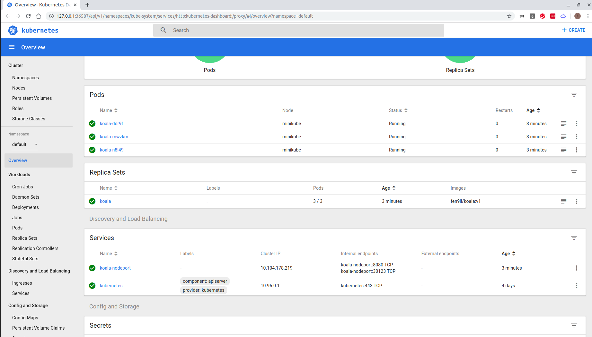

## clean up local docker images
```
feng@ubuntu:~/k8s-v2/ReplicaSet$ docker images | grep kubia
fen9li/kubia           v4.0.0              d6328a5c3c3c        8 hours ago         660MB
fen9li/kubia           v3.0.0              fac4ec6ae2f9        24 hours ago        660MB
fen9li/kubia           v2.0.0              771370886e94        27 hours ago        660MB
fen9li/kubia           v1.0.0              670e99ccfc86        27 hours ago        660MB
feng@ubuntu:~/k8s-v2/ReplicaSet$ 

feng@ubuntu:~/k8s-v2/ReplicaSet$ docker images | grep kubia | awk '{print $3}'
d6328a5c3c3c
fac4ec6ae2f9
771370886e94
670e99ccfc86
feng@ubuntu:~/k8s-v2/ReplicaSet$ 

docker rmi `docker images | grep kubia | awk '{print $3}'`

feng@ubuntu:~/k8s-v2/ReplicaSet$ docker images | grep kubia
feng@ubuntu:~/k8s-v2/ReplicaSet$ 
```

## prepare docker image
```
feng@ubuntu:~/k8s-v2/ReplicaSet$ ll
total 20
drwxr-xr-x 2 feng feng 4096 Jul 20 19:52 ./
drwxr-xr-x 5 feng feng 4096 Jul 20 19:27 ../
-rw-r--r-- 1 feng feng  356 Jul 20 19:52 app-v1.js
-rw-r--r-- 1 feng feng   64 Jul 20 19:52 Dockerfile
-rw-r--r-- 1 feng feng  813 Jul 20 19:51 README.md
feng@ubuntu:~/k8s-v2/ReplicaSet$ 

feng@ubuntu:~/k8s-v2/ReplicaSet$ 

docker build --tag fen9li/koala:v1 .
docker push fen9li/koala:v1

feng@ubuntu:~/k8s-v2/ReplicaSet$
```

## create and expose service (with nodeport)
```
feng@ubuntu:~/k8s-v2/ReplicaSet$ k create -f service.yaml --save-config
replicaset.apps/koala created
service/koala-nodeport created
feng@ubuntu:~/k8s-v2/ReplicaSet$

feng@ubuntu:~/k8s-v2/ReplicaSet$ minikube ip
192.168.99.101
feng@ubuntu:~/k8s-v2/ReplicaSet$ 

feng@ubuntu:~/k8s-v2/ReplicaSet$ curl http://192.168.99.101:30123
You've hit koala-ddr9f
feng@ubuntu:~/k8s-v2/ReplicaSet$ curl http://192.168.99.101:30123
You've hit koala-n8l49
feng@ubuntu:~/k8s-v2/ReplicaSet$ curl http://192.168.99.101:30123
feng@ubuntu:~/k8s-v2/ReplicaSet$ curl http://192.168.99.101:30123
You've hit koala-mwzkm
feng@ubuntu:~/k8s-v2/ReplicaSet$ 
```

